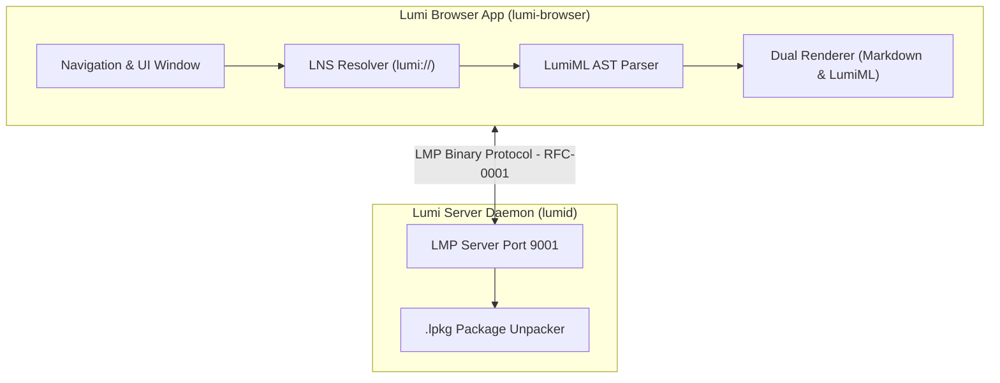

# Lumi - Experimental Rust Browser Platform

[](https://github.com/satwik/Lumi/actions/workflows/ci.yml)
[](LICENSE)
[](https://www.rust-lang.org/)

Lumi is a proof-of-concept, experimental web platform built from scratch in Rust (Zero Chromium, Zero Electron, Zero HTML/CSS/JS stack). It demonstrates custom protocol handling, parsing, and rendering pipelines in pure Rust.

> **Project Status**: **Experimental Prototype / Proof of Concept**  
> *Documentation and implementation are grounded in current engineering reality rather than production claims.*

---

## What is Lumi?

Lumi is an exploration into custom systems programming for local networking and UI rendering, designed with zero telemetry and modular Rust components.

<<<<<<< HEAD
### Core Architectural Features:
- **Dual Presentation Pipeline**:
  -  **Native CommonMark Markdown (`index.md`)**: Renders documentation, RFCs, blogs, wikis, and static text content cleanly using pure Rust native UI widgets.
  -  **LumiML Engine (`index.lml`)**: Renders interactive applications, dashboards, chat systems, games, and rich UI elements via a custom AST layout parser.
- **LMP Transport Protocol (RFC-0001)**: A binary-multiplexed TCP network protocol running over default port `9001` with zero tracking, zero header bloat, and instant stream multiplexing.
- **LNS Resolver (RFC-0003)**: Lumi Name Service for resolving `.lumi` domain names (e.g. `lumi://welcome.lumi`, `lumi://docs.lumi`).
- **LPKG Package Format (RFC-0004)**: Binary site archive format bundling `index.md` or `index.lml` along with asset resources.

---

##  Ecosystem Documentation & Specifications

-  **[Lumi Technical Whitepaper](docs/LUMI_WHITEPAPER.md)**: Architecture, Privacy Model, & Security Analysis.
-  **[Developer Quickstart Guide](docs/DEVELOPER_GUIDE.md)**: 5-minute tutorial to build and host Lumi sites.
-  **Formal RFC Specifications**:
=======
### Feature Matrix & Reality Check

| Feature Area | Status | Description |
| :--- | :--- | :--- |
| **Dual Presentation Pipeline** | **Prototype** | CommonMark Markdown rendering (`index.md`) & basic LumiML layout parser (`index.lml`). |
| **LMP Protocol (`RFC-0001`)** | **Experimental** | Custom binary TCP framing running locally on default port `9001`. |
| **LNS Resolver (`RFC-0003`)** | **Local Resolver Prototype** | In-memory/local domain resolver for `.lumi` names (e.g. `lumi://welcome.lumi`). |
| **LPKG Format (`RFC-0004`)** | **Basic Package Builder** | Bundles `index.md`/`index.lml` assets into a binary package for serving. |
| **Search & Directory** | **Static Directory** | Static list/directory mock (`lumi://search.lumi`). Search engine engine planned. |
| **Messaging / Chat UI** | **Static UI Prototype** | Static chat user interface layout (`lumi://chat.lumi`). |

---

## 📚 Ecosystem Specifications

*The following RFCs outline the experimental design goals for the platform:*

- 📄 **[Lumi Technical Whitepaper](docs/LUMI_WHITEPAPER.md)**: Architecture & Prototype Goals.
- 🚀 **[Developer Guide](docs/DEVELOPER_GUIDE.md)**: Guide to run local server and packages.
- 📑 **RFC Specifications**:
>>>>>>> 685a934 (chore: improve engineering quality and project documentation)
  - [RFC-0001: LMP Core Binary Protocol](docs/rfcs/RFC-0001-LMP.md)
  - [RFC-0002: LumiML Markup Standard](docs/rfcs/RFC-0002-LumiML.md)
  - [RFC-0003: Lumi Name Service (LNS)](docs/rfcs/RFC-0003-LNS.md)
  - [RFC-0004: LPKG Package Standard](docs/rfcs/RFC-0004-LPKG.md)
  - [RFC-0005: Lumi Extension API (.lpx)](docs/rfcs/RFC-0005-Extension-API.md)
  - [RFC-0006: Open Governance Model](docs/rfcs/RFC-0006-Community-Governance.md)
  - [RFC-0007: Security & Threat Model](docs/rfcs/RFC-0007-Security-Model.md)

---

<<<<<<< HEAD
##  Project Components
=======
## 🛠 Project Architecture & Components


>>>>>>> 685a934 (chore: improve engineering quality and project documentation)

```text
lumi/
├── docs/                     (Whitepaper, Quickstart Guide, and RFCs)
├── protocol/                 (LMP framing, local LNS resolver, .lpkg format)
├── parser/                   (LumiML tokenizer, parser & AST)
├── renderer/                 (Dual CommonMark Markdown & LumiML layout engine)
├── server/                   (lumid - Local daemon serving .lpkg site packages on port 9001)
├── browser/                  (Lumi browser app supporting *.lumi navigation)
└── cli/                      (Lumi SDK CLI - `lumi new` & `lumi pack`)
```

---

##  Quickstart

### 1. Launch the Lumi Server Daemon (`lumid`)
```bash
cargo run -p lumid
```

### 2. Launch the Lumi Browser
```bash
cargo run -p lumi-browser
```

### 3. Build a Lumi Package (`lumi-cli`)
```bash
cargo run -p lumi-cli -- new my-site
cargo run -p lumi-cli -- pack my-site my-site.lpkg
```

---

<<<<<<< HEAD
##  License
=======
## 🚦 Roadmap & Implementation Status

- [x] **Implemented**: Local TCP protocol framing, parser AST foundation, Markdown & basic LumiML layout rendering, CLI packager.
- [ ] **In Progress**: Unit test coverage expansion for protocol parser/framing edge cases, CI linting & formatting checks.
- [ ] **Planned**: Dynamic search capabilities, cryptographic transport layer, extended widget library.

---

## 📜 License
>>>>>>> 685a934 (chore: improve engineering quality and project documentation)

Released under the **Apache License, Version 2.0**.
