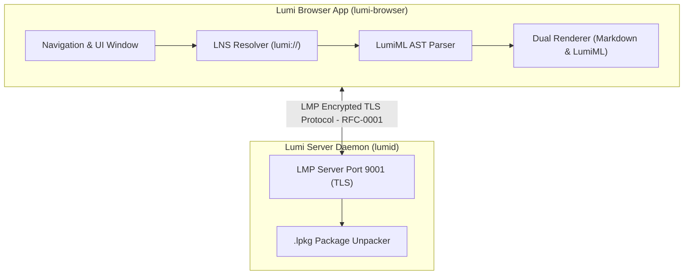

# Lumi - Experimental Rust Browser Platform

[](https://github.com/satwik/Lumi/actions/workflows/ci.yml)
[](https://github.com/satwik/Lumi/actions/workflows/fuzz.yml)
[](LICENSE)
[](https://www.rust-lang.org/)
[](https://github.com/rustsec/rustsec)

Lumi is a proof-of-concept, experimental web platform built from scratch in Rust (Zero Chromium, Zero Electron, Zero HTML/CSS/JS stack). It demonstrates custom protocol handling, parsing, and rendering pipelines in pure Rust.

> **Project Status**: **Experimental Prototype / Proof of Concept**  
> *Documentation and implementation are grounded in current engineering reality rather than production claims.*

---

## What is Lumi?

Lumi is an exploration into custom systems programming for local networking and UI rendering, designed with zero telemetry and modular Rust components.

### Core Architectural Features:
- **Dual Presentation Pipeline**:
  - **Native CommonMark Markdown (`index.md`)**: Renders documentation, RFCs, blogs, wikis, and static text content cleanly using pure Rust native UI widgets.
  - **LumiML Engine (`index.lml`)**: Renders interactive applications, dashboards, chat systems, games, and rich UI elements via a custom AST layout parser.
- **LMP Transport Protocol (RFC-0001)**: A binary-multiplexed encrypted TLS protocol running over default port `9001` with zero tracking, zero header bloat, and instant stream multiplexing.
- **LNS Resolver (RFC-0003)**: Lumi Name Service for resolving `.lumi` domain names (e.g. `lumi://welcome.lumi`, `lumi://docs.lumi`).
- **LPKG Package Format (RFC-0004)**: Binary site archive format bundling `index.md` or `index.lml` along with asset resources.

### Feature Matrix & Reality Check

| Feature Area | Status | Description |
| :--- | :--- | :--- |
| **Dual Presentation Pipeline** | **Prototype** | CommonMark Markdown rendering (`index.md`) & basic LumiML layout parser (`index.lml`). |
| **LMP Protocol (`RFC-0001`)** | **Experimental** | Custom binary TLS framing running locally on default port `9001`. |
| **Transport Layer Security** | **Active (rustls)** | 100% Rust TLS v1.3/v1.2 transport encryption for all LMP socket streams. |
| **LNS Resolver (`RFC-0003`)** | **Local Resolver Prototype** | In-memory/local domain resolver for `.lumi` names (e.g. `lumi://welcome.lumi`). |
| **LPKG Format (`RFC-0004`)** | **Basic Package Builder** | Bundles `index.md`/`index.lml` assets into a binary package for serving. |
| **Search & Directory** | **Static Directory** | Static list/directory mock (`lumi://search.lumi`). |
| **Messaging / Chat UI** | **Static UI Prototype** | Static chat user interface layout (`lumi://chat.lumi`). |

---

## 📚 Ecosystem Specifications

- 📄 **[Lumi Technical Whitepaper](docs/LUMI_WHITEPAPER.md)**: Architecture & Prototype Goals.
- 🚀 **[Developer Guide](docs/DEVELOPER_GUIDE.md)**: Guide to run local server and packages.
- 📑 **RFC Specifications**:
  - [RFC-0001: LMP Core Binary Protocol](docs/rfcs/RFC-0001-LMP.md)
  - [RFC-0002: LumiML Markup Standard](docs/rfcs/RFC-0002-LumiML.md)
  - [RFC-0003: Lumi Name Service (LNS)](docs/rfcs/RFC-0003-LNS.md)
  - [RFC-0004: LPKG Package Standard](docs/rfcs/RFC-0004-LPKG.md)
  - [RFC-0005: Lumi Extension API (.lpx)](docs/rfcs/RFC-0005-Extension-API.md)
  - [RFC-0006: Open Governance Model](docs/rfcs/RFC-0006-Community-Governance.md)
  - [RFC-0007: Security & Threat Model](docs/rfcs/RFC-0007-Security-Model.md)

---

## 🛠 Project Architecture & Components



```text
lumi/
├── docs/                     (Whitepaper, Quickstart Guide, and RFCs)
├── protocol/                 (LMP framing, TLS stream wrapper, local LNS resolver, .lpkg format)
├── parser/                   (LumiML tokenizer, parser & AST)
├── renderer/                 (Dual CommonMark Markdown & LumiML layout engine)
├── server/                   (lumid - Local daemon serving .lpkg site packages on port 9001 over TLS)
├── browser/                  (Lumi browser app supporting *.lumi navigation over TLS)
└── cli/                      (Lumi SDK CLI - `lumi new` & `lumi pack`)
```

---

## 🔒 Transport Security (TLS)

Lumi implements first-class transport security over socket connections using `rustls` (100% Rust cryptography, zero C/OpenSSL dependencies):

- **Why TLS was added**: Encrypts all LMP protocol traffic against local network eavesdropping and tampering, while providing server identity verification.
- **TLS Handshake First**: The browser performs a TLS handshake before any LMP binary headers or frame payloads are transmitted.
- **Development Certificates**: If certificate files (`certs/dev_cert.pem` & `certs/dev_key.pem`) do not exist at startup, `lumid` automatically generates self-signed development certificates for local domain resolution (`.lumi`, `localhost`, `127.0.0.1`).
- **Custom Certificate Paths**:
  ```bash
  cargo run -p lumid -- --cert path/to/cert.pem --key path/to/key.pem
  ```
- **Security Scope & Distinctions**:
  - Development self-signed certificates enable local testing without third-party CA infrastructure.
  - TLS protects transport-layer socket communication between the browser and server daemon; it is distinct from end-to-end user-level application encryption.

---

## 🚀 Quickstart

### 1. Launch the Lumi Server Daemon (`lumid`)
```bash
cargo run -p lumid
```
*(Auto-generates dev TLS certificates at `certs/dev_cert.pem` if not present)*

### 2. Launch the Lumi Browser
```bash
cargo run -p lumi-browser
```

### 3. Build a Lumi Package (`lumi-cli`)
```bash
cargo run -p lumi-cli -- new my-site
cargo run -p lumi-cli -- pack my-site my-site.lpkg
```

---

## 🛡️ Security & Quality

Lumi enforces high engineering quality standards, memory safety, and security audit practices:

- **Continuous Integration (GitHub Actions)**: Automated workflows (`.github/workflows/ci.yml`) run on every push and pull request to validate formatting, linting, testing, and dependency vulnerabilities.
- **Code Formatting (`cargo fmt`)**: Code style consistency is enforced across all workspace crates using `rustfmt`:
  ```bash
  cargo fmt --all
  ```
- **Linter & Best Practices (`cargo clippy`)**: Strict linting rules are enforced with zero warnings:
  ```bash
  cargo clippy --workspace --all-targets --all-features -- -D warnings
  ```
- **Unit & Integration Testing (`cargo test`)**: Comprehensive unit and integration test coverage across `protocol`, `parser`, `renderer`, `server`, `browser`, `cli`, and TLS handshakes:
  ```bash
  cargo test --workspace
  ```
- **Dependency Security Audit (`cargo audit`)**: Automated scanning for known security vulnerabilities in dependencies via `RustSec`:
  ```bash
  cargo install cargo-audit
  cargo audit
  ```
- **Fuzz Testing (`cargo-fuzz`)**: Stress testing protocol decoders and markup parsers against malformed or hostile inputs to ensure no panics, memory corruption, or infinite loops:
  - Fuzzing runs weekly on a scheduled GitHub Actions workflow (`.github/workflows/fuzz.yml`).
  - To run fuzz targets locally (requires Rust nightly):
    ```bash
    cargo fuzz run lmp_message_read_from
    cargo fuzz run lumiml_parser
    ```

---

## 🚦 Roadmap & Implementation Status

- [x] **Implemented**: Local TLS protocol framing, parser AST foundation, Markdown & basic LumiML layout rendering, CLI packager.
- [x] **Security & Quality**: Continuous Integration, `cargo-audit` dependency vulnerability scanning, `rustls` TLS encryption, and `cargo-fuzz` stress-testing targets.
- [ ] **Planned**: Dynamic search capabilities, cryptographic identity layer, extended widget library.

---

## 📜 License

Released under the **Apache License, Version 2.0**.
