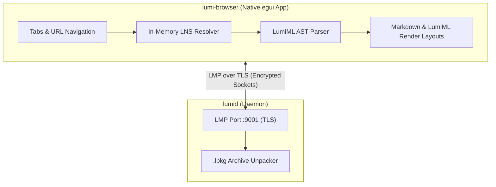

# Lumi — Experimental Rust Browser Platform

[](https://github.com/sxwik/Lumi/actions/workflows/ci.yml)
[](https://github.com/sxwik/Lumi/actions/workflows/fuzz.yml)
[](LICENSE)
[](https://www.rust-lang.org/)
[](https://github.com/rustsec/rustsec)

Lumi is a proof-of-concept web platform built from scratch in Rust. Yes, that means **zero Chromium, zero Electron, and absolutely zero HTML/CSS/JS**. 

Why? Because writing a custom protocol, a hand-rolled recursive-descent parser, and wrapping everything in transport-layer TLS is a perfectly reasonable way to spend a weekend instead of using standard web technologies that actually work.

> **Project Status: Extremely Experimental Prototype**  
> Everything listed here exists, compiles, and passes Clippy. However, do not try to run your bank on it. The name resolver lives entirely in memory, and the "search engine" is just a hardcoded list of sites we think are cool.

---

##  The Tech Stack (or: What We Built Instead of Sleeping)

- **LMP Protocol (RFC-0001)** — Our custom binary-framed TCP protocol. Now featuring actual transport security via `rustls` on port `9001`. It has zero header bloat and zero telemetry, mostly because we don't have enough users to track anyway.
- **LumiML Engine (RFC-0002)** — A declarative markup language. Instead of parsing HTML, we built our own recursive-descent parser. It handles exactly 17 element types. If you try to render a `<div>`, nothing will happen, and you will deserve it.
- **Markdown Pipeline** — Renders native CommonMark Markdown directly into `egui` widgets. It works great for text, documentation, and making things look like it's 1996.
- **LNS Resolver (RFC-0003)** — The "Lumi Name Service". Currently an in-process hash map that maps `.lumi` domains to local ports. Think of it as DNS, but without the actual network roundtrips or DNSSEC headaches.
- **LPKG Format (RFC-0004)** — A binary package archive. Bundles your markup and assets into a single file so `lumid` can unpack it and serve it.
- **lumid** — The server daemon. It spawns one thread per connection and serves `.lpkg` packages over TLS.
- **lumi-cli** — The SDK CLI. Run `lumi new` and `lumi pack` to build packages before you realize you don't know how to style them.

---

##  Reality Check & Implementation Status

| Component | Status | Reality |
| :--- | :--- | :--- |
| **LMP Framing** | **Working** | Binary headers + length-prefixed JSON metadata. Solid. |
| **TLS Transport** | **Working** | Powered by `rustls` (1.3/1.2). Automatically generates dev certs because setting up a real CA is painful. |
| **LumiML AST Parser** | **Working** | Recursive-descent parser. Handles nesting, headers, and codeblocks. |
| **Markdown Renderer** | **Working** | Renders static CommonMark text without melting your GPU. |
| **lumid daemon** | **Working** | Listens on port `9001`, accepts TLS streams, throws bytes. |
| **Lumi Browser** | **Working** | A native `egui` desktop app with tabs, history, a dev console, and a stubbed out extension registry. |
| **LNS Resolver** | **Static Mock** | Just an in-memory registry. Don't try to query Cloudflare for it. |
| **chat.lumi** | **Working** | First interactive Lumi app! Instant, bidirectional multi-client chat over persistent TLS streams with 50-message in-memory history. |
| **search.lumi** | **Static Directory** | A hardcoded list of local pages. Google is not sweating. |

---

##  How It Fits Together



```text
lumi/
├── protocol/   LMP packet framing, LNS, LPKG packaging & the TLS engine
├── parser/     LumiML tokenizer, parser & syntax tree
├── renderer/   The egui paint layout engine for MD and LumiML
├── server/     lumid - The local network server daemon
├── browser/    lumi-browser - Desktop app with tabs and dev console
├── cli/        lumi SDK tool for scaffolding/packing sites
├── fuzz/       Where LLVM tries to crash our parser and fails
└── docs/       Specs, RFCs, and guides for the brave
```

---

##  Transport Security (TLS)

We don't use OpenSSL. Why? Because compiling C dependencies in a Rust workspace is a form of self-harm. Instead, we use `rustls` (100% safe Rust):

- The browser establishes a secure TLS session **before** any LMP protocol frames are exchanged.
- When you run `lumid`, it checks for `certs/dev_cert.pem` and `certs/dev_key.pem`. If they aren't there, it generates a fresh self-signed key pair on the fly using `rcgen`.
- To use your own production/test certificates:
  ```bash
  cargo run -p lumid -- --cert path/to/cert.pem --key path/to/key.pem
  ```

*Note: Dev certificates (`certs/`) are ignored by git because committing private keys to GitHub is how servers get mined for Monero.*

---

## 💬 Interactive Chat App (chat.lumi)

`lumi://chat.lumi` is our first real interactive application! It proves that the Lumi Protocol (LMP) supports persistent, real-time bidirectional communication over TLS without standard HTTP web sockets or JavaScript.

- **Persistent TLS Stream**: No polling or page reloads required.
- **Instant Multi-Client Broadcasting**: Open two `lumi-browser` windows to `lumi://chat.lumi`, type a message in one, and watch it appear instantly in the other!
- **In-Memory Message Backlog**: `lumid` keeps the last 50 messages in memory so newly connected clients immediately see recent history upon joining.
- **Zero Panic Architecture**: Uses structured error handling with zero `unwrap()` or `expect()` calls in networking code paths.

---

##  Quickstart

**1. Fire up the server daemon**
```bash
cargo run -p lumid
# Generates dev TLS certs in certs/ if they don't exist yet
```

**2. Open the browser**
```bash
cargo run -p lumi-browser
# Type lumi://welcome.lumi in the URL bar and enjoy the views
```

**3. Build your own site package**
```bash
cargo run -p lumi-cli -- new my-cool-page
cargo run -p lumi-cli -- pack my-cool-page my-cool-page.lpkg
```

---

##  Code Quality & Pedantry

We run Clippy with `-D warnings` because we enjoy being yelled at by the compiler. We also fuzz our network decoders and markup parsers.

| Quality Check | Tool | CLI Command |
| :--- | :--- | :--- |
| **Formatting** | `rustfmt` | `cargo fmt --all --check` |
| **Lints** | `clippy` | `cargo clippy --workspace --all-targets --all-features -- -D warnings` |
| **Tests** | `cargo test` | `cargo test --workspace` |
| **Security Audit** | `cargo-audit` | `cargo audit` |
| **Fuzzing** | `cargo-fuzz` | `cargo fuzz run lmp_message_read_from` |

---

##  Specs & RFCs

If you are suffering from insomnia, feel free to read our protocol and language specifications:
- [Lumi Technical Whitepaper](docs/LUMI_WHITEPAPER.md)
- [Developer Guide](docs/DEVELOPER_GUIDE.md)
- [RFC-0001: LMP Protocol Spec](docs/rfcs/RFC-0001-LMP.md)
- [RFC-0002: LumiML Markup Spec](docs/rfcs/RFC-0002-LumiML.md)
- [RFC-0003: LNS Resolver Spec](docs/rfcs/RFC-0003-LNS.md)
- [RFC-0004: LPKG Package Spec](docs/rfcs/RFC-0004-LPKG.md)
- [RFC-0005: Extension API Spec](docs/rfcs/RFC-0005-Extension-API.md)
- [RFC-0006: Governance Plan](docs/rfcs/RFC-0006-Community-Governance.md)
- [RFC-0007: Threat & Security Model](docs/rfcs/RFC-0007-Security-Model.md)

---

##  License

Distributed under the Apache License, Version 2.0. See [LICENSE](LICENSE) for details.